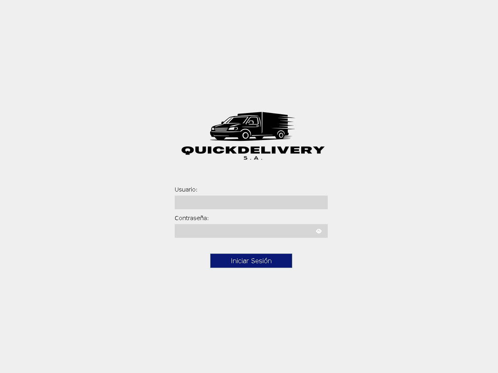
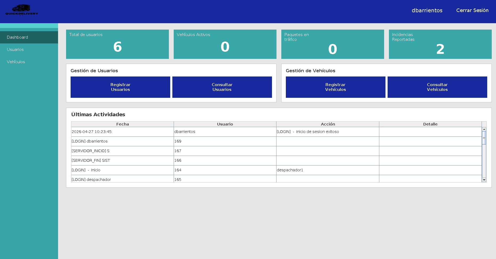
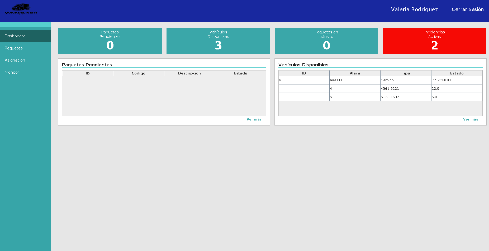
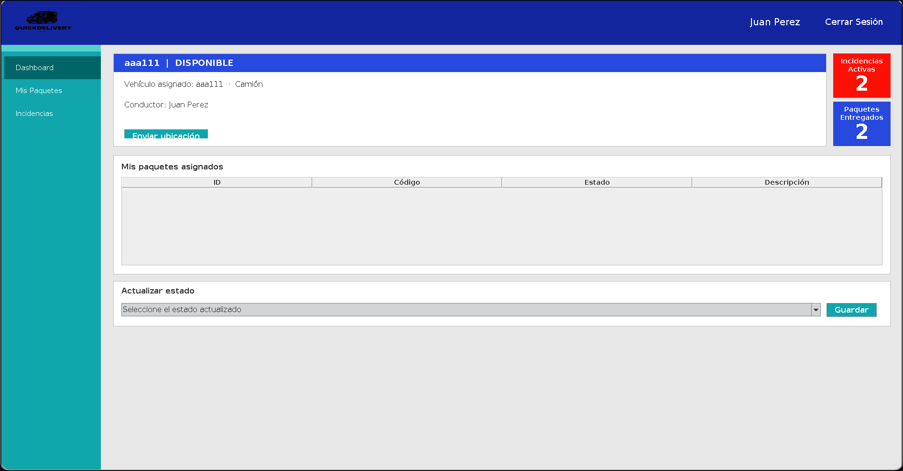

# 📦 QuickDelivery S.A. — Sistema de Gestión y Monitoreo de Entregas

> Aplicación de escritorio cliente-servidor para la gestión integral de entregas de paquetes, con monitoreo en tiempo real, control de flotas y trazabilidad completa de operaciones.

---

## 📸 Apartado Visual

| Pantalla | Vista |
|----------|-------|
| Login |  |
| Dashboard Administrador |  |
| Dashboard Despachador |  |
| Dashboard Conductor |  |

> 📁 Las imágenes deben colocarse en la carpeta `docs/screenshots/` con los nombres exactos indicados arriba.

---

## 🧩 Descripción del proyecto

QuickDelivery S.A. es un sistema multicapa desarrollado en **Java** con arquitectura **cliente-servidor sobre sockets TCP**. Permite a una empresa de logística coordinar en tiempo real el ciclo completo de una entrega: desde el ingreso de un paquete al sistema, su asignación a un vehículo de la flota, el seguimiento en ruta por parte del conductor, hasta la confirmación de entrega o el reporte de incidencias.

El sistema implementa tres roles de usuario con interfaces diferenciadas: **Administrador**, **Despachador** y **Conductor**, cada uno con acceso exclusivo a las funcionalidades que le corresponden.

---

## ⚙️ Tecnologías utilizadas

| Tecnología | Uso |
|------------|-----|
| Java 17+ | Lenguaje principal |
| Java Swing | Interfaz gráfica de escritorio |
| Sockets TCP (`java.net`) | Comunicación cliente-servidor |
| MySQL 8 | Base de datos relacional |
| JDBC + `mysql-connector-j 8.3.0` | Acceso a datos |
| Maven | Gestión de dependencias y build |
| `ObjectOutputStream` / `Serializable` | Persistencia de configuración del servidor |

---

## 🏗️ Arquitectura del sistema

El proyecto sigue una arquitectura en capas separada físicamente entre servidor y cliente:

```
┌─────────────────────────────────┐      TCP / texto plano (puerto 5000)
│         CLIENTE (Swing)         │ ◄────────────────────────────────────►
│  view  ──►  ConexionServidor    │
└─────────────────────────────────┘

┌─────────────────────────────────────────────────────────────────────────┐
│                          SERVIDOR                                        │
│  ServidorQuickDelivery                                                   │
│       └── ClientHandler (1 hilo por cliente)                            │
│              └── Controllers (AuthController, PaqueteController, etc.)  │
│                     └── DAOs (PaqueteDAO, VehiculoDAO, etc.)            │
│                            └── ConexionDB ──► MySQL                     │
└─────────────────────────────────────────────────────────────────────────┘
```

### Estructura de paquetes

```
src/main/java/.../
├── client/
│   ├── util/
│   │   └── ConexionServidor.java       # Singleton TCP del cliente
│   └── view/
│       ├── LoginFrame.java
│       ├── MenuAdminFrame.java
│       ├── MenuDespachadorFrame.java
│       ├── MenuConductorFrame.java
│       ├── GestionDeUsuariosFrame.java
│       ├── EdicionDeUsuariosFrame.java
│       ├── GestionDeVehiculosFrame.java
│       ├── EdicionDeVehiculosFrame.java
│       ├── GestionDePaquetesFrame.java
│       ├── AsignacionDePaquetesFrame.java
│       ├── MonitorDeEntregasFrame.java
│       ├── MisPaquetesFrame.java
│       └── IncidenciasFrame.java
├── model/
│   ├── Vehiculo.java                   # Clase abstracta base
│   ├── Camion.java / Furgon.java / Moto.java
│   ├── Paquete.java
│   ├── Asignacion.java
│   ├── Usuario.java
│   ├── Incidencia.java
│   ├── Rol.java                        # Enum: ADMINISTRADOR, DESPACHADOR, CONDUCTOR
│   ├── EstadoPaquete.java              # Enum: EN_ESPERA, EN_TRANSITO, ENTREGADO, INCIDENCIA
│   ├── EstadoVehiculo.java
│   ├── TipoAccion.java
│   └── ConfiguracionSistema.java       # Serializable — persiste configuración del servidor
├── server/
│   ├── ServidorQuickDelivery.java      # Punto de entrada del servidor
│   ├── ClientHandler.java              # Runnable — 1 instancia por cliente conectado
│   ├── controller/
│   │   ├── AuthController.java
│   │   ├── UsuarioController.java
│   │   ├── PaqueteController.java
│   │   ├── VehiculoController.java
│   │   └── AsignacionController.java
│   ├── dao/
│   │   ├── UsuarioDAO.java
│   │   ├── PaqueteDAO.java
│   │   ├── VehiculoDAO.java
│   │   ├── AsignacionDAO.java
│   │   ├── IncidenciaDAO.java
│   │   └── AuditoriaDAO.java
│   └── util/
│       ├── ConexionDB.java             # JDBC singleton — lee config.properties
│       └── Logger.java                 # Escribe en quickdelivery.log y BD
└── exception/
    ├── ConexionException.java
    └── ValidacionException.java
```

---

## 🔌 Protocolo de comunicación

La comunicación entre servidor y clientes se realiza mediante **texto plano separado por `|`** sobre sockets TCP. Esta decisión de diseño minimiza las dependencias del cliente (solo requiere `java.io` y `java.net` estándar, sin librerías de serialización externas), actúa como medida de seguridad al definir un conjunto cerrado y explícito de comandos reconocidos por el servidor (cualquier mensaje que no coincida es rechazado con `ERROR`), y facilita la trazabilidad ya que los mensajes son legibles directamente en el log del sistema sin necesidad de deserializar binarios.

### Comandos principales

| Dirección | Comando | Descripción |
|-----------|---------|-------------|
| Cliente → Servidor | `LOGIN_APP\|user\|pass` | Autenticación |
| Cliente → Servidor | `GET_USUARIOS` | Lista todos los usuarios |
| Cliente → Servidor | `CREATE_USUARIO\|nombre\|user\|pass\|rol\|estado` | Registrar usuario |
| Cliente → Servidor | `GET_VEHICULOS_DISPONIBLES` | Vehículos sin asignación activa |
| Cliente → Servidor | `CREATE_PAQUETE\|codigo\|descripcion\|peso` | Registrar paquete |
| Cliente → Servidor | `ASIGNAR\|idPaquete\|idVehiculo` | Asignar paquete a vehículo |
| Cliente → Servidor | `GET_MONITOR` | Vehículos en ruta + paquetes en tránsito |
| Cliente → Servidor | `ESTADO\|idPaquete\|nuevoEstado` | Conductor actualiza estado |
| Cliente → Servidor | `CREATE_INCIDENCIA\|desc\|idPaquete\|idConductor` | Reportar incidencia |
| Servidor → Cliente | `OK\|mensaje` | Operación exitosa |
| Servidor → Cliente | `DATA\|campo1\|campo2\|...` | Registro único |
| Servidor → Cliente | `LIST\|TIPO\|fila1~fila2~...` | Lista de registros |
| Servidor → Cliente | `ERROR\|descripción` | Error de negocio o SQL |
| Servidor → Cliente | `FORBIDDEN\|motivo` | Sin permisos |

---

## 👥 Roles del sistema

### 🔴 Administrador
- Gestión completa de usuarios (CRUD)
- Gestión completa de vehículos (CRUD)
- Acceso al log de auditoría
- Vista del dashboard general del sistema

### 🟡 Despachador
- Registro de nuevos paquetes
- Asignación de paquetes a vehículos disponibles
- Monitor de entregas en tiempo real (auto-refresh)
- Visualización de estado de la flota

### 🟢 Conductor
- Vista de paquetes asignados a su vehículo
- Actualización de estado de cada paquete
- Reporte de incidencias con descripción
- Envío de ubicación actual

---

## 🗄️ Base de datos

El sistema utiliza MySQL. Las credenciales se configuran en el archivo `config.properties` ubicado en el classpath del servidor:

```properties
db.url=jdbc:mysql://localhost:3306/quickdelivery
db.user=root
db.password=tu_password
```

### Tablas principales

| Tabla | Descripción |
|-------|-------------|
| `USUARIO` | Usuarios del sistema con rol y estado |
| `VEHICULO` | Flota de vehículos (Camión, Furgón, Moto) |
| `PAQUETE` | Paquetes registrados y su estado actual |
| `ASIGNACION` | Relación paquete ↔ vehículo/conductor |
| `INCIDENCIA` | Incidencias reportadas por conductores |
| `AUDITORIA_LOG` | Registro completo de acciones del sistema |

---

## 🚀 Cómo ejecutar el proyecto

### Prerrequisitos

- Java 17 o superior
- MySQL 8 corriendo localmente
- Maven 3.8+

### 1. Configurar la base de datos

Crea la base de datos en MySQL e importa el script SQL del proyecto:

```sql
CREATE DATABASE quickdelivery;
```

Luego ejecuta el script de creación de tablas e inserción de datos iniciales incluido en `src/main/resources/quickdelivery.sql`.

### 2. Configurar las credenciales

Edita `src/main/resources/config.properties`:

```properties
db.url=jdbc:mysql://localhost:3306/quickdelivery
db.user=root
db.password=tu_password
```

### 3. Compilar el proyecto

```bash
mvn clean package
```

### 4. Iniciar el servidor

```bash
# Ejecutar la clase ServidorQuickDelivery
mvn exec:java -Dexec.mainClass="com.mycompany.sistema.de.gestion.y.monitoreo.de.entregas.server.ServidorQuickDelivery"
```

Al iniciar, el servidor pedirá el puerto (por defecto `5000`) y comenzará a aceptar conexiones. La configuración queda persistida en `quickdelivery_config.ser`.

### 5. Iniciar el cliente

```bash
# En otra terminal, ejecutar LoginFrame
mvn exec:java -Dexec.mainClass="com.mycompany.sistema.de.gestion.y.monitoreo.de.entregas.client.view.LoginFrame"
```

> 💡 Puedes abrir múltiples instancias del cliente para simular diferentes usuarios conectados simultáneamente.

---

## 📝 Auditoría y logs

Cada operación relevante (login, creación de paquetes, asignaciones, cambios de estado, incidencias) queda registrada en dos lugares:

- **Archivo `quickdelivery.log`** — en el directorio de trabajo del servidor, formato: `yyyy-MM-dd HH:mm:ss | ACCION | ACTOR | DETALLE`
- **Tabla `AUDITORIA_LOG`** en MySQL — consultable desde el panel del Administrador

---

## 📐 Patrones y conceptos aplicados

- **Singleton** — `ConexionServidor` (cliente) y `ConexionDB` (servidor)
- **Herencia y polimorfismo** — jerarquía `Vehiculo` → `Camion`, `Furgon`, `Moto` con `calcularCapacidad()` abstracto
- **Patrón DAO** — separación total entre lógica de negocio y acceso a datos
- **Multihilos** — un `Thread` por cliente conectado mediante `ClientHandler implements Runnable`; colección compartida con `ConcurrentHashMap`
- **Serialización Java** — `ConfiguracionSistema implements Serializable` persiste el estado del servidor entre reinicios
- **Protocolo de texto plano** — protocolo propio sobre TCP, sin dependencias externas en el cliente
- **Shutdown hook** — el servidor guarda su configuración automáticamente al recibir señal de cierre

---

## 👨‍💻 Autores

Proyecto desarrollado para el curso **SC-303 Programación Cliente/Servidor**.

---

## 📄 Licencia

Este proyecto es de uso académico.

## 📚 Anexos

- [📄 Documentación Técnica del Sistema (PDF)](docs/documentacion_tecnica.pdf)
- [📄 Manual de Usuario y Operación (PDF)](docs/manual_usuario.pdf)

---
